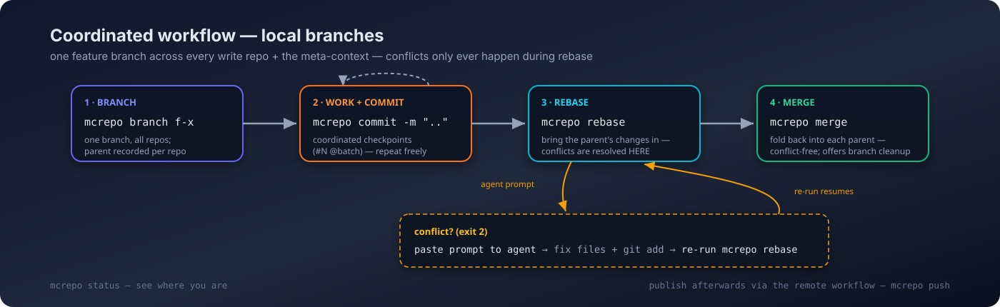
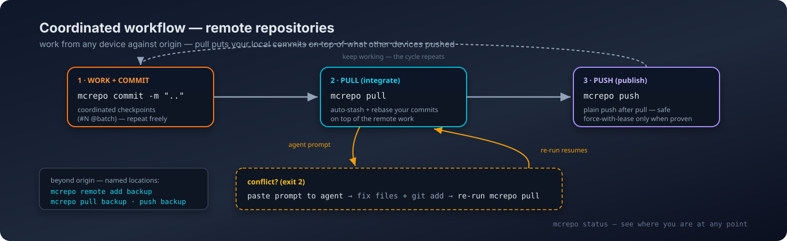

# mcrepo.sh

An AI-agent-first **Multi-Context Repository** (MC-Repo) tool for macOS and Linux.
It lets you work across many independent Git repositories in one local directory context, without migrating them into a monorepo. All managed by just one shell script: `mcrepo.sh` with practical workspace governance for multi-repo agent workflows.

The workspace root that holds `mcrepo.yaml` and the shared `+-` folders is called the **meta-context repo** throughout this document and in command output (see the [Glossary](#glossary)).


## The Coordinated Workflow

Two simple loops — and on conflict the rule is always the same: mcrepo prints a paste-ready
prompt for your coding agent, the agent fixes and stages the files, and you **re-run the same
command** until it reports done.

### Local branches — feature work



| Step | Command | What it does |
|---|---|---|
| 1 · Branch | `mcrepo branch feat-x` | one feature branch across all write repos + the meta-context ([details](#branch-coordination)) |
| 2 · Work + commit | `mcrepo commit -m "…"` | coordinated, revertable checkpoints — repeat as often as you like ([details](#coordinated-commits)) |
| 3 · Rebase | `mcrepo rebase` | bring the parent's changes into the branch; **all conflicts are resolved here** — on conflict, re-run after the fix ([details](#rebasing-onto-the-parent)) |
| 4 · Merge | `mcrepo merge` | fold the branch back into each parent — conflict-free after a clean rebase; offers branch cleanup ([details](#merging-back)) |

### Remote repositories — origin and named locations



| Step | Command | What it does |
|---|---|---|
| Work + commit | `mcrepo commit -m "…"` | same coordinated checkpoints as above |
| Pull (integrate) | `mcrepo pull` | rebase your local commits on top of what other devices pushed; asks what to do with uncommitted changes (`--dirty discard` takes origin's state) — on conflict, re-run after the fix ([details](#pulling)) |
| Push (publish) | `mcrepo push` | plain push after a pull; force-with-lease only when provably safe ([details](#pushing)) |

Around the loops:

- `mcrepo status` — every repo's branch, state, and stuck indicators at a glance
- `mcrepo remote add backup` — declare a named location; then `mcrepo pull backup` / `mcrepo push backup` ([details](#named-remote-locations))
- Review flow instead of a direct push: `mcrepo pr` opens coordinated, cross-linked GitHub PRs ([details](#fork--pr-workflow))
- Backing out entirely: `mcrepo abort` ([details](#conflicts--recovery))

## Install & Setup

### Prerequisites

- bash 3.2+ (macOS stock bash works), git (2.38+ required for `mcrepo merge`'s conflict dry-run)
- optional: [GitHub CLI `gh`](https://cli.github.com/) for fork/PR/access-check features, `python3` for VS Code settings sync, `jq` for organization sync without `gh`

### Setup

- Create an empty repository
- Open it in VSCode (optional)
- Open Terminal

Excute one-liner in empty repository:

```bash
curl -fsSL https://raw.githubusercontent.com/GeektankLabs/mcrepo/main/mcrepo.sh -o ./mcrepo.sh && chmod +x ./mcrepo.sh && ./mcrepo.sh init
```

`init` automatically downloads and installs the mcrepo VS Code extension when the `code` CLI is available. To install or reinstall the extension manually at any time:

```bash
mcrepo install-extension
```

After `init`, close terminal and open a new one:

```bash
mcrepo help
```

Add repositories to your meta context:

```bash
mcrepo add <git-url>
```

If you added all needed repositories to your Meta-Context-Repository then run the suggested prompt with your local AI agent tool of choice (OpenCode, Codex CLI, Claude Code, etc) - they have now all those repositories as context and can make coordinated feature changes, documentation and integrated dev & tests setups for you.

### Publishing the workspace itself

The base mcrepo workspace can be either a plain directory or a git repository. To make it git-managed and back it up to an empty external remote (e.g. a freshly-created empty GitHub repo) in one step:

```bash
mcrepo publish-base <git-url>
```

`publish-base` is safe to run whether or not the workspace already has a `.git/`:

- if no `.git/` yet → `git init` first, then commit and push
- if `.git/` exists with no `origin` → attach origin and push
- if `.git/` exists with `origin` already pointing to `<git-url>` → just push (idempotent)

Before the first commit, `publish-base` reconciles `.gitignore` against `mcrepo.yaml` so that external sub-repos stay excluded and local incubator sub-repos stay tracked. This guards against accidentally bundling an external sub-repo's working tree into the workspace's initial commit.

## Modes and Visibility

Repositories added with `mcrepo add <git-url>` start in `read` mode; fork/upstream workflows (`add --fork`, `fork`, interactive upstream choices) default to `write` since their purpose is contributing changes.

- `👀 read`: context available, no edits intended
- `✏️ write`: active repository where changes should be done
- `💤 sleep`: currently not relevant; reduce active scope

Switch modes with:

```bash
mcrepo write <repo-name>
mcrepo read <repo-name>
mcrepo sleep <repo-name>
mcrepo status
```

Repository folder names are always clean (no mode or emoji prefix in directory names). Mode visibility is tracked in `mcrepo.yaml` and can be decorated in the editor.

When a repo is set to `sleep`, mcrepo clears the local checkout **including `.git`** and leaves two placeholders in that folder: `.gitignore` and `.mcrepo-sleep`. Switching back to `read` or `write` checks out the repository again.

Because sleeping deletes the clone, mcrepo first scans for local work that would be lost — uncommitted changes, untracked files, unpushed commits on any branch, stashes — and refuses (or prompts) when it finds any. `sleep <repo> --force` discards such work explicitly.

## Incubator Sub-Repos

To quickly try out a new project idea inside an mcrepo workspace - without first creating an external git repo - use `mcrepo new`:

```bash
mcrepo new my-new-idea
```

This creates `./my-new-idea/` and records it in `mcrepo.yaml` with `local: true` (no `url:`). The directory is **tracked by the base mcrepo** (not gitignored) so its files become part of the base mcrepo's git history as you work on them. There is no separate `.git/` inside the incubator yet.

While a sub-repo is in local incubator state:

- `mcrepo list` shows it with a 🌱 indicator.
- Modes (`write` / `read` / `sleep`) still apply as **pure agent-intent signals**. Unlike external repos, `sleep` on a local repo is non-destructive: it just flips the mode tag; the files stay on disk and in base history.
- Per-repo git operations (`mcrepo pull`, `push`, `branch`, `merge`, per-repo `commit`) silently skip local repos since they have no `.git/` yet.
- You commit changes to local repo files via the base mcrepo's normal `git add` / `git commit` workflow (or just leave them as files if base isn't git-managed yet - see `publish-base` above).

When the idea proves itself, graduate the repo to a fresh external remote:

```bash
# 1. Create an empty repo on GitHub (or any git service), copy its URL
# 2. Graduate the incubator:
mcrepo publish my-new-idea git@github.com:me/my-new-idea.git
```

`publish` will:

1. Validate the remote URL is reachable and empty (refuses non-empty remotes unless `--force`).
2. If the base mcrepo is a git repo: `git rm -r --cached` the dir to untrack, add `/my-new-idea/` to base `.gitignore`, and create a scoped commit recording the untracking. (Old base history still contains the files - non-destructive.)
3. `git init` inside `./my-new-idea/`, stage all files, commit them as the initial commit (default message `Initial commit`, override with `-m`).
4. Add `origin` remote pointing to the URL and push.
5. Update `mcrepo.yaml`: remove `local: true`, add the external `url:`.

From that point on, mcrepo treats the repo like any other external sub-repo (pull/push/branch/merge apply normally).

## Branch Coordination

Before implementing a cross-repo feature, set one coordinated branch name across write repositories:

```bash
mcrepo branch <feature-branch-name>
```

Behavior details:

- When `<name>` already exists locally or on origin, mcrepo treats this as a **branch jump** — no new parent is recorded, and the parent stack is reconciled (see below). When `<name>` is new, it's a **fork** — the current branch is recorded as parent.
- If forking, mcrepo shows a confirmation prompt listing which repos will fork vs jump.
- If any target repo has uncommitted changes, mcrepo offers interactive options:
  - **Abort** — stop and handle manually
  - **Commit** — auto-commit to current branch before switching
  - **Carry** — carry changes into the target branch (stash + pop, with dry-run safety check)
  - **Discard** — discard all uncommitted changes
- For scripts and agents, preselect the answer with `--dirty abort|commit|carry|discard` (non-interactive runs abort by default).
- If a carry run is interrupted (Ctrl-C), re-running `mcrepo branch <name>` finishes the switch and restores the carried stashes automatically; `mcrepo status` shows a `stash=N` indicator for repos with stashes.
- If `<name>` exists on `origin` but not locally, mcrepo creates a local tracking branch from `origin/<name>`.
- After updating target repos, mcrepo switches the meta-context repo to the same branch as the final step.
- Each repo's previous branch is automatically recorded as its parent branch in `mcrepo.yaml`, enabling `mcrepo merge` later (only on fork, not on jump).
- The parent stack is a nested ancestry chain, so its entries are always distinct and never name the active branch. Jumping back to a branch the stack still lists as a parent drops that level and everything above it — those levels belong to branches you left without merging. Jumping to a branch outside the chain clears it, and `mcrepo merge` falls back to the detected default branch. Manifests that already carry leaked levels are repaired the next time mcrepo reads them; `mcrepo doctor` reports what it repaired.

This keeps feature work aligned and makes later per-repo commits and pull requests easier to coordinate.

To turn off coordinated branching (last-resort fallback):

```bash
mcrepo branch --off
```

After `--off`, repos remain on their current branches without coordination. For a cleaner workflow, prefer `mcrepo merge` (integrate changes) or `mcrepo branch --delete` (discard branch).

### Discarding a Branch

To discard the current global branch and switch all repos back to their parent branches:

```bash
mcrepo branch --delete
```

This is the counterpart to `mcrepo merge`. While `merge` saves work into the parent, `--delete` discards the feature branch entirely:
- Aborts if any repo has uncommitted changes
- Switches each repo back to its immediate parent branch
- Deletes the feature branch locally
- Removes that branch's parent record (nested branches supported)

### Rebasing onto the Parent

Merging back is strictly two-step: **rebase first, then merge**. `mcrepo rebase` rebases the
coordinated branch onto each repo's parent, so conflicts are resolved *on the feature branch* —
the later merge into the parent is then always conflict-free.

```bash
mcrepo rebase                  # rebase the global branch onto each parent (auto-stash)
mcrepo rebase --include-read   # also sync read-mode repos that joined via 'branch --include-read'
```

Behavior details:

- `rebase` prefers `origin/<parent>` as the target (so it picks up newly merged work from
  other PRs; falls back to local `<parent>` when no origin is configured). Auto-stashes
  uncommitted work, including untracked files.
- On a rebase conflict, `rebase` keeps going through the remaining repos, prints per-repo context
  plus a paste-ready prompt for a local coding agent, and exits `2`. The report names the
  operation id, how far the rebase got (`commit 12 of 44`, with the commit being replayed), the
  **kind** of each collision (`both-modified`, `deleted-by-us`, …), and the version on each side
  when `mcrepo.sh` or `mcrepo.yaml` is involved. After the files are resolved and staged,
  **re-run `mcrepo rebase`** — it finishes the paused rebases and restores auto-stashed changes —
  see [Conflicts & Recovery](#conflicts--recovery).
- **Generated-artifact collisions are resolved automatically** (by removing the file) when the
  path both matches a known generated shape (`+-tests/artifacts/`, `__pycache__/`, `*.pyc`,
  `+-tests/.runtime/`) *and* the repo's own `.gitignore` covers it. Machine output carries no
  reviewable intent, so it should not cost a stop-and-re-run cycle. A repo that deliberately
  versions such evidence has no matching ignore rule and keeps being asked. Disable with
  `MCREPO_NO_AUTO_CLEAN=1`.
- `rebase` refuses to rewrite a branch whose `origin/<branch>` holds commits the local branch
  lacks: replaying would strand them and the later force-publish would delete them. Run
  `mcrepo pull` first.
- Rebasing rewrites local history, so an already-pushed branch will diverge from its remote.
  mcrepo **records** what it rewrote (the remote tip it started from, the tip it produced) in
  local git refs under `refs/mcrepo/prov/`, so the later push can prove the divergence is yours
  even when conflict resolution changed the commits beyond recognition. It flags those branches
  at the end and tells you to run `mcrepo push` — which force-with-leases them
  (see [Pushing](#pushing)); you do **not** need to force-push by hand.
- Without `--include-read`, read-mode repos sitting on the branch are listed with a hint instead
  of being silently stranded.
- `mcrepo merge --rebase` still works as a deprecated alias and prints a deprecation warning.

### Merging Back

After the branch is synced, squash it back into each repo's parent branch:

```bash
mcrepo merge                  # squash; subject defaults to the source branch name
mcrepo merge -m "feat: ..."   # squash with explicit subject
mcrepo merge --include-read   # also merge read-mode repos that joined via 'branch --include-read'
mcrepo merge --no-squash      # legacy: --no-ff merge commit per repo
```

`merge` needs git 2.38+ (it dry-runs conflicts with `git merge-tree --write-tree`; `mcrepo doctor` checks this).

Behavior details:

- `mcrepo merge` requires a global branch to be set, and **requires the branch to be synced**:
  when any repo's branch is behind its parent (local or `origin/<parent>`), merge refuses and
  points you to `mcrepo rebase`. Because conflicts are always resolved during the rebase, the merge
  itself cannot conflict.
- **Default strategy is squash.** Each repo gets one new commit on its parent whose subject is either `-m "..."` or the source branch name. WIP commits on the feature branch are collapsed away. Use `--no-squash` for the previous `git merge --no-ff` behavior.
- Parent branches are recorded automatically by `mcrepo branch` — each repo can have a different parent.
- The meta-context repo (`.`) participates in both branching and merging with its own parent tracking (`meta-parent:` in `mcrepo.yaml`); it merges last, and only after every sub-repo merged.
- Repos not on the source branch are **skipped with a notice** (already merged by a previous
  partial run, or manually switched) instead of failing the whole merge; only an empty merge set
  is an error.
- `merge` performs a conflict dry-run across ALL repos before touching anything, and fast-forwards
  each local parent to `origin/<parent>` before merging so the squash lands on the same history
  the rebase moved onto (no phantom divergence at push time).
- **A failed repo never blocks the rest**: the failed repo is rolled back to exactly its
  pre-merge state on the feature branch, the remaining repos keep merging, the summary reports
  `PARTIAL`, and the run exits `2` with a paste-ready recovery prompt. Fix the cause and re-run
  `mcrepo merge` — already-merged repos are skipped automatically.
- Merges are local only (no push). Review and push per-repo when ready.
- Nested branches are supported: `main → feature → sub-feature`. Each `merge` consumes one branch's record and leaves the rest of the tree intact.
- After a squash merge, the source branch's tip is no longer reachable from the parent, so the post-merge cleanup uses **force-delete** (`git branch -D`) with an explicit confirmation defaulting to **No**. The `--no-squash` path keeps the previous safe-delete (`git branch -d`) prompt.
- The merge auto-commits the updated `mcrepo.yaml` in the meta-context (subject: `mcrepo: post-merge state — '<source>' merged into '<target>'`) so the updated parent records and global branch land in git history immediately. Run `mcrepo push` afterward to publish the merge along with this state commit. Only `mcrepo.yaml` is staged — unrelated dirty files in the meta-context are left alone.
- When no parent is recorded, mcrepo falls back to detecting the default branch (via `origin/HEAD`, remote query, or heuristic).

## Conflicts & Recovery

Conflicts are a normal part of coordinated work. mcrepo never auto-resolves them — it explains
the state, keeps every side of the conflict recoverable, and prints a **paste-ready prompt for
your local coding agent** whenever it stops on a state it won't resolve itself.

The recovery loop — **the command is the loop**:

```
mcrepo rebase / pull      # the operation stops on a conflict, prints the agent prompt
  → resolve the files     # only REAL conflicts — the prompt tells the agent the rules
  → git add <files>       # staging is the "resolved" signal (agent does this too)
  → re-run the command    # finishes paused rebases, restores stashes, reports next step
                          # (repeat if it finds further conflicts)
```

The stuck states and how `mcrepo status` shows them:

| State | How it happens | `status` shows | How to finish |
|---|---|---|---|
| Rebase conflict | `rebase`, `pull` | `inprogress=REBASING` | resolve → `git add` → re-run the command |
| Merge conflict | manual `git merge` | `inprogress=MERGING` | resolve → `git add` → `git commit` |
| Squash conflict (no git marker!) | manual squash-merge | `inprogress=CONFLICTED` | resolve → `git add` → `git commit` |
| Stash-pop conflict (no git marker!) | auto-stash restore after rebase/pull | `inprogress=CONFLICTED` + `mcrepo-stash=N` | resolve → `git add` → re-run the command (drops the applied stash) |
| Carry conflict | `branch <name>` with carried changes | `mcrepo-stash=N` | resolve → `git add` → re-run `mcrepo branch <name>` |
| Ambiguous divergence | remote has work that is not your rebase | `upstream=ahead/behind` | review with the agent prompt; never blind force-push |
| Partial merge | one repo failed mid-`merge` | repo back on feature branch | fix cause → re-run `mcrepo merge` |
| Partial coordinated commit | commit failed in some repos | mixed `#N` HEADs | complete the batch with the exact printed subject |

Backing out instead of finishing:

```bash
mcrepo abort      # git <op> --abort in every mid-op repo; also clears marker-less conflicts
                  # (git reset --merge) while preserving stashes
```

Sleep-mode repos are skipped; the meta-context participates as well.

**How to prompt your coding agent:** paste the prompt mcrepo prints at the moment it stops. It
briefs the agent on the coordinated-branch model, lists the affected repos, paths, and files,
and sets a strictly LOCAL contract: the agent may only edit files and `git add` — no mcrepo, no
`git rebase/commit/stash/push`, nothing needing network access or credentials (it works even
when the agent runs in a VM without your git logins). The rules: resolve only *real* semantic
conflicts, keep the parent side's formatting on formatting-only collisions, never keep
duplicated `mcrepo commit #N` coordination commits — and when done, the agent tells you to
re-run the mcrepo command in your workspace. Generated workspaces also ship a
`conflict-resolution` skill and an AGENTS.md "Conflict Recovery" section, so local agents know
the procedure even without the paste.

## Coordinated Commits

Commit related changes across all dirty write repos (and the meta-context) as one logical unit:

```bash
mcrepo commit -m "message"          # coordinated commit across dirty write repos + meta-context
mcrepo commit --include-read -m ".."# also include read-mode repos
mcrepo commit --include-artifacts -m ".." # also commit generated artifacts (off by default)
mcrepo commit --revert              # peel the newest coordinated commit off HEAD (reset --hard HEAD~1)
mcrepo commit --reset               # discard uncommitted changes across all target repos
```

Behavior details:

- Each coordinated commit gets a subject `mcrepo commit #N @<batch-id>: <message>` so the group can be recognized later.
- **Generated artifacts are left out.** Paths matching `+-tests/artifacts/`, `+-tests/.runtime/`,
  `__pycache__/` or `*.pyc` are not staged; the skipped paths are always listed by name, never
  dropped silently, and the files stay untouched on disk. The reason is downstream: once machine
  output is in history, every rebase that crosses those commits replays it as conflicts that carry
  no reviewable decision. Pass `--include-artifacts` when you deliberately version test evidence.
  `mcrepo doctor` reports artifacts that are *already* tracked (a `.gitignore` rule does not
  untrack them) and prints the `git rm -r --cached` needed to stop the bleeding.
- `--revert` only peels repos whose HEAD carries the same `#N` **on the same branch and with the same batch id** — repos on other branches or with mismatched batch ids are skipped (override with `--force`). It refuses without `--force` when the commit is already pushed.
- `--revert`/`--reset` are destructive; non-interactive runs require `--force`.

## Pulling

```bash
mcrepo pull            # integrate from origin: auto-stash + rebase local commits onto remote work
mcrepo pull --ff-only  # conservative pull: fast-forward only, dirty sub-repos are skipped
mcrepo pull --reset    # discard local changes and reset to origin state (destructive!)
```

### Working from Multiple Devices

`mcrepo pull` is the origin-side twin of `mcrepo rebase` — the same pattern, pointed at a
different base: `rebase` targets the feature branch's **parent**, `pull` targets
your local commits onto **origin**. Same recovery loop, same commands.

When you sit down at a device that has local work while another device already pushed:

```
mcrepo pull             # per repo: auto-stash dirty work → rebase local commits
                        # on top of the remote work → restore the stash
   ⇣ conflict?          # exit 2 — repo pauses, agent prompt printed
(agent fixes + git add) # strictly local: edit files, stage them — nothing else
mcrepo pull             # re-run: finishes the paused rebases, restores stashes
mcrepo push             # plain push — your commits now sit on top of origin
```

No repo is ever left half-pulled and undescribed: repos that hit conflicts pause visibly
(`mcrepo status` shows them), the rest complete, and re-running `pull` finishes the
stragglers — the same resume model as `rebase` and `merge`.

Behavior details:

- **Uncommitted changes are your call.** When a repo is dirty, `pull` shows exactly which files
  and asks what to do — `[a]` abort, `[r]` carry (stash, pull, restore), `[d]` discard and take
  origin's state — with `[R]`/`[D]` to apply the same answer to every remaining dirty repo. Answer
  up front with `--dirty abort|carry|discard`; that is also the non-interactive form, and
  `--dirty discard` is the "just give me the latest, fresh" button for a machine that only consumes
  code. With no answer and no terminal, `pull` carries, exactly as it always has — existing scripts
  are unaffected. Note the difference from `--reset`: `--dirty discard` throws away *uncommitted*
  changes and then pulls normally, while `--reset` additionally offers to drop local *commits*.
- **A stash pop that conflicts says what conflicted.** The file and the kind of collision
  (`both-modified`, `deleted-by-them`, …) are printed on the first run, and carried into the agent
  prompt — previously only the repo name was reported, which left nothing to act on. Generated
  artifacts that collide this way are auto-resolved on the same terms as during a rebase (the path
  must match the generated-paths list **and** be covered by the repo's own `.gitignore`).
- **`mcrepo.yaml` never conflicts.** The manifest is machine-owned — mcrepo rewrites it
  canonically on every coordinated command, and `branch:`/`parent:`/`meta-parent:` change with
  each of them. Two machines therefore edit the *same lines* without either of them touching
  code, which is not something git's textual merge can settle. So `pull` takes the manifest out
  of the operation before it starts (parking your version in the object database, never in the
  stash), lets the pull run, then merges it back **field by field** against the pre-pull `HEAD`:
  `branch:` is what is checked out *here*, so a local value always wins; `parent:` maps merge
  key by key, so one machine recording `feature-x:main` and another recording `other:main` both
  survive; every other field is a normal three-way merge, and a field genuinely changed on both
  sides keeps origin's value and says so by name. A local manifest that says nothing the
  committed one does not — the formatting drift `mcrepo update` used to leave behind — is
  discarded outright, so a machine that only consumes code stays clean. If the pull pauses on a
  conflict, your manifest stays parked and the re-run applies it. Opt out with
  `MCREPO_NO_MANIFEST_MERGE=1`.
- **`--ff-only` is the conservative mode**: fast-forward only, dirty sub-repos are skipped
  (fetch only), nothing is ever stashed or rebased. When a branch has genuinely diverged
  (another device pushed), it names the repos and points back to plain `pull`.
- `--rebase` still works as a deprecated alias of the default and prints a warning.
- **`--rebase` never rebases onto a stale remote**: after `mcrepo rebase` rewrote history, the old
  `origin/<branch>` still holds pre-rebase commits — rebasing onto it would resurrect them.
  mcrepo proves this case by **patch-equivalence** (every remote-only commit also exists
  locally, as-is or rebased) and routes you to `mcrepo push` instead.
- **Genuinely ambiguous divergence is never auto-resolved**: when the remote both predates your
  rebase *and* carries content-new commits (e.g. another device pushed onto the stale branch, or
  your rebase had conflict resolutions), rebasing could resurrect old history and force-pushing
  could delete the new work — mcrepo touches nothing and prints the agent prompt instead.
- The meta-context auto-stashes on dirty so unrelated edits never block its pull.
- Uncommitted changes ride along via auto-stash; if restoring them conflicts, the stash is
  preserved and the repo shows `inprogress=CONFLICTED` (see [Conflicts & Recovery](#conflicts--recovery)).
- `rebase`, `pull`, and `branch` may run over their *own* paused states — re-running them IS the
  resume. Foreign states (a manual `git merge` in progress) still block, and `commit`/`merge`
  stay strictly guarded, so a stuck repo can never turn into a half-pulled workspace.
- `--reset` confirms before discarding uncommitted changes, and **separately per repo** before discarding committed-but-unpushed commits (it lists them first). `--yes` skips both confirmations for automation; without it, non-interactive runs keep such repos untouched.

### Named Remote Locations

Beyond `origin` (and the fork-workflow `upstream`), a workspace can declare additional named
locations — a backup host, a mirror, a second forge:

```bash
mcrepo remote add backup             # declare the location; asks one URL per repo (Enter = skip)
mcrepo remote set alpha backup <url> # set/change a single repo's URL (--off clears it)
mcrepo remote list                   # locations + per-repo URLs
mcrepo pull backup                   # integrate from the location (rebase local commits on top)
mcrepo push backup                   # plain-push write repos there — locations are NEVER forced
mcrepo remote remove backup          # remove the location everywhere (confirmed)
```

- Location names live in `mcrepo.yaml` (`locations:`), per-repo URLs under each repo's
  `remotes:` field — repos without a URL for a location are simply skipped and reported.
- `mcrepo add` asks for each declared location when you add a new repo interactively.
- `pull <location>` uses the same conflict loop as origin pull (pause → agent prompt → re-run),
  and never rebases onto a provably stale mirror — it routes you to `push <location>` instead.
- `push <location>` refuses when the location holds commits you lack (pull from it first);
  there is no force variant for locations by design.

## Pushing

```bash
mcrepo push                 # fetch, refuse if behind, then push ahead repos
mcrepo push -m "message"    # also commit dirty write-mode repos before pushing
mcrepo push --include-read  # also push read-mode repos (coordinated --include-read work)
mcrepo push --no-fetch      # skip the safety fetch (faster, less safe)
mcrepo push --no-force      # disable auto force-with-lease for rebased branches
mcrepo push --approve-rebased alpha,bi-homepage   # reviewed override for an unprovable rewrite
```

Behavior details:

- Before pushing, mcrepo fetches `origin` for every push target (write-mode
  sub-repos plus meta-context). It then computes both **ahead** and **behind**
  per repo. A **failed** fetch disables force-publishing for that repo — a
  stale remote-tracking ref must never authorize a rewrite.
- **Rebased branches are auto-published.** After `mcrepo rebase`, a
  coordinated branch diverges from its already-pushed `origin/<branch>` (ahead
  *and* behind) purely because the rebase rewrote its commit hashes. mcrepo
  establishes this in two ways, in this order:
  1. **The rebase record** (`recorded-safe-rebase`) — mcrepo performed the
     rewrite, so it wrote down the remote tip it started from and the tip it
     produced. If the remote is still exactly where it was, and HEAD still
     descends from the produced tip, the rewrite is provably yours. This is the
     only evidence that survives conflict resolution.
  2. **Patch-equivalence** (`safe-force`) — every commit the remote holds also
     exists locally, as-is or in rebased form. Used when there is no record,
     for example when the rebase happened on another device.
  Either way it publishes with an **explicit** lease
  (`--force-with-lease=refs/heads/<branch>:<observed-tip>`, shown as
  `[REBASED -> force-push]` in the plan). Pinning the tip matters: a bare
  `--force-with-lease` is re-read from the remote-tracking ref at push time, so
  a background fetch — an editor's autofetch, a second mcrepo run — would
  quietly renew the lease. With the tip pinned, anything landing on the remote
  after the classification rejects the push. Pass `--no-force` (or
  `--no-fetch`) to opt out. mcrepo never uses a plain `--force`.
- If a target is behind in a way that is **not** a provable rebase (the remote
  already contains work mcrepo can't attribute to your rebase), `push` aborts
  before any commit or push happens, suggests `mcrepo pull`, and prints a
  paste-ready prompt you can hand to a local coding agent to resolve the
  divergence. This avoids partial-success runs where the first repos succeed
  and the rest get rejected mid-run. Note `--no-fetch` is **not** a way past
  this: it only skips the local check and also disables force-publishing, so
  the remote rejects the push instead.
- **`--approve-rebased <names>`** is the reviewed override for that case — the
  usual reason is a rebase performed on another device, so no record exists on
  this machine. It prints the remote tip, how many commits there would be
  dropped, and your local tip, then publishes under a lease pinned to that
  exact remote tip. It never degrades to a plain `--force`, and it applies only
  to the named repos on this one run. Names are comma-separated; the workspace
  itself is `(meta-context)`.
- Failures from `git push` (auth, branch protection, hooks, non-fast-forward)
  are now printed verbatim above the summary so the cause is visible.
- Without `-m` and in non-interactive context, dirty repos are skipped (not
  silently committed). With `-m "msg"` (or interactive prompt) dirty repos
  are auto-committed via `git add -A`.
- The meta-context repo is pushed last so that sub-repo references in the
  meta-context can capture the freshly pushed sub-repo states.

## Fork & PR Workflow

For repos where you lack push access, mcrepo manages the fork triangle (origin = your fork, upstream = the original repo):

```bash
mcrepo add <git-url>              # interactive when GitHub + gh: offers origin / fork / upstream / read-only
mcrepo fork <repo-or-url> [name]  # fork via gh: origin=your fork, upstream=original
mcrepo fork --all [--yes]         # fork+rewire every repo where you lack push access (plan + confirm)
mcrepo upstream                   # show origin/upstream per repo
mcrepo upstream <repo> <url>      # set/replace the PR target for the fork workflow
mcrepo upstream <repo> --off      # remove the upstream relationship
mcrepo doctor                     # git/gh/auth status + per-repo origin/upstream/access report
```

`mcrepo write <repo>` also checks push access (with `gh`) and offers to fork on the spot when you have none.

After coordinated work on a global branch, open pull requests for every repo with commits against its base:

```bash
mcrepo pr                          # coordinated PRs per repo, cross-linked with each other
mcrepo pr -m "title" [--draft]     # explicit title / draft PRs
mcrepo pr --target origin|upstream # choose the PR target; defaults to upstream when set (fork workflow)
mcrepo pr --no-push                # do not auto-push the branch before opening PRs
```

Each PR body links the sibling PRs so reviewers see the whole coordinated change set.

## Removing a Repository

```bash
mcrepo remove <name-or-url>              # drop the manifest entry and delete the local folder
mcrepo remove <name-or-url> --keep-files # keep the folder, only drop the entry
```

Before deleting, mcrepo scans for local work (uncommitted/untracked/unpushed on any branch/stashes) and prompts; `--force` skips all prompts.

## Organization Sync

`mcrepo init <organization>` imports all non-archived repos of a GitHub organization into the manifest (via `gh`, falling back to the public API with `curl`+`jq`).

## Status

```bash
mcrepo status
```

Per repo, mcrepo prints:

- `mode` (read/write/sleep), `local` (checked out yes/no), `branch`
- `state` — `clean` / `dirty`
- `upstream=<…>` — `in-sync`, `ahead=N behind=M`, or `no-upstream`
  (computed from local refs only — run `mcrepo pull` or `mcrepo push` to
  refresh first if you need the latest remote state)
- `inprogress=<…>` — `MERGING` / `REBASING` / `CHERRY-PICKING` / `REVERTING`
  / `BISECTING` when the repo is mid-operation
- `OFF-GLOBAL` — when the global branch is set but this repo sits on a
  different branch
- `parent=<stack>` — recorded parent branch stack (see Branch Coordination)

## VS Code Workflow

- Keep the meta-context root open in one VS Code window to see all repositories and shared coordination folders.
- `🗂` is the simplified mcrepo context logo used for MC-Repo actions in UI labels.
- During `./mcrepo.sh init`, mcrepo ensures `.vscode/settings.json` exists with SCM multi-repository defaults (`alwaysShowRepositories`, `selectionMode=multiple`, `autoRepositoryDetection=subFolders`, `repositoryScanMaxDepth=2`). Existing settings files are kept unchanged.
- mcrepo maintains `git.ignoredRepositories` in `.vscode/settings.json` for repos currently in `sleep` mode to reduce stale SCM detection; existing user entries are preserved.
- After `init`, mcrepo attempts to trigger a VS Code window reload via the `code` CLI; if that is not possible, it prints a hint to reload/restart VS Code manually.
- In the VS Code Explorer context menu (sub-repo folder right-click), the extension shows MC-Repo mode actions as `🗂 ✏️ Set Write`, `🗂 👀 Set Read`, and `🗂 💤 Set Sleep`.
- The VS Code extension watches `mcrepo.yaml` / `.vscode/settings.json` and prompts a window reload when repo topology changes (new repo or sleep<->active transitions) may require SCM refresh.
- If a write repository has changes, open it in a dedicated VS Code window:

```bash
mcrepo open <repo-name>
```

- Commit and push inside that repository, preserving per-repo autonomy.

## Directory Structure After Init

`init` generates coordination directories in the meta-context root:

- `+-contracts/`: cross-repo interfaces and contracts
- `+-docs/`: architecture, integration notes, and generated overviews
- `+-tests/`: integration test setup and shared test assets
- `+-skills/`: company and project specific skills (`skill.md`) with optional colocated helper scripts
- `mcrepo.yaml`: source of truth for repos, modes, descriptions, and branch
- `AGENTS.md`: generated workspace instructions that enforce mode gates and proactively point agents to RepoMapper MCP for codebase overview and Playwright for browser validation when available

Design ordering principle:

- Repositories use clean top-level names.
- Shared folders (`+-contracts`, `+-docs`, `+-tests`, `+-skills`) are created directly at the top level.
- The `+-` prefix is ASCII-only and shell-friendly (no quoting needed). VS Code shows emoji badges (🧩 🧾 🧪 🧠) next to each folder when the mcrepo plugin is installed.
- The old visual separator directory is no longer created. Legacy schemes (`🧪 tests/`, `tests/`, etc.) are migrated automatically on `init`.

## Skills and Workspace Governance

Use `mcrepo` skill commands to manage workspace-local skill packs:

```bash
mcrepo skill list
mcrepo skill new <skill-id>
mcrepo skill install <github-url>
mcrepo skill install <clawhub-url>
mcrepo skill <repo-name> install <github-url|clawhub-url>
mcrepo skill enable <skill-id>
mcrepo skill disable <skill-id>
mcrepo skill validate
```

Skill source support:

- GitHub URLs are supported for direct skill import.
- ClawHub URLs are supported and scanned through Gen Agent Trust Hub before install.
- Recommended public skill directory: `https://clawhub.ai/skills`

ClawHub scan policy defaults:

- `CRITICAL` scan severity blocks install.
- `HIGH` scan severity warns and continues.
- Use `--skip-scan` to bypass scanner checks.
- Use `--require-scan` to fail when scan cannot be performed.

Activation behavior:

- If `+-skills/skills.yaml` exists, enable/disable state is taken from that file.
- If `+-skills/skills.yaml` is missing, every `+-skills/<id>/skill.md` is treated as active.
- MC workspace skills are mirrored into `.opencode/skills/` so OpenCode can auto-discover them.
- For sub-repositories, use standard `.opencode/skills/` (no emoji folder) for local skill installs.

Skill layout (colocated docs + helpers):

```text
+-skills/
  skills.yaml
  _templates/
    skill-template.md
  change-implementation/
    skill.md
    run.sh   # optional helper
```

Authoring notes:

- Keep each skill self-contained in `+-skills/<id>/`.
- Put process and guardrails in `skill.md`.
- Put optional executable helpers (`run.sh`, `check.sh`) next to `skill.md`.
- Use lowercase kebab-case skill IDs (for example: `release-prep`, `test-gate`).

Default skill pack created during `init`:

- `change-implementation`
- `test-gate` (includes Playwright guidance for web-facing validation when available)
- `release-prep`
- `no-secrets`
- `subproject-skill-loader` (loads sub-repo local skills only for write/change scope)

These are starter skills meant to be edited or replaced with your company-specific workflows.

## AI-Agent-First Starter Tasks

After adding repositories, useful first tasks are:

1. Ask your agent to scan all `read` repos and write an interface map into `+-docs/`.
2. Ask your agent to scaffold an integration test setup (for example Docker Compose) in `+-tests/`.
3. Ask your agent which repos should be switched to `write` for your next feature.

## Why This Instead of a Monorepo?

- No full migration of codebases into one repository.
- No forced unified build and release system.
- Still supports coordinated cross-repo feature work.
- Better fit when repos are already split by ownership and domain.

This means lightweight context orchestration, not a central release manager.

## Private Meta-Repo Pattern

You can keep component repositories public/open-source while keeping the `mcrepo` workspace repository private for internal coordination.

## Private Repos & Authentication

Private repos over HTTPS need credentials on every fetch. macOS answers these from the Keychain automatically; **Linux ships no default credential helper**, so without setup git prompts for username/token on every network operation — across a whole workspace that means a prompt storm on each `mcrepo pull`. (`mcrepo pull` itself performs exactly one network round-trip per repo; the prompts come from git, not from mcrepo.)

**Recommended fix — let GitHub CLI answer git's credential requests** (one-time, per machine):

```bash
gh auth login        # interactive — or: echo "$TOKEN" | gh auth login --with-token
gh auth setup-git    # registers gh as git's credential helper for github.com
```

After that, every HTTPS git operation against github.com is authenticated silently with gh's token — all repos readable by that account, including private ones. Verify with:

```bash
git config --get-urlmatch credential.helper https://github.com
```

`mcrepo doctor` checks this for every HTTPS host in your manifest and prints the fix when a helper is missing.

**Alternatives** (no gh, non-GitHub hosts, or different security trade-offs):

| Strategy | Command | Trade-off |
|---|---|---|
| Store (plaintext) | `git config --global credential.helper store` | token lands in `~/.git-credentials`; enter once, never again |
| Cache (RAM only) | `git config --global credential.helper 'cache --timeout=28800'` | enter once per session, cached 8h, nothing on disk |
| Keyring (desktop) | `git config --global credential.helper libsecret` | encrypted via GNOME/KDE Secret Service; needs a desktop session |
| SSH instead of HTTPS | `git config --global url."git@github.com:".insteadOf "https://github.com/"` + an SSH key | key instead of token; rewrites transparently — no `mcrepo.yaml` change needed |

## Additional Options

- Skip shell config installation during init (recommended for CI or disposable sandboxes):

```bash
./mcrepo.sh init --no-shell-install
```

- `init` always uses clean repo folder names:

```bash
./mcrepo.sh init
```


## Versioning and Self-Update

- `mcrepo version` prints the version; a banner also goes to **stderr** on every run (stdout stays clean for scripting).
- `mcrepo` checks the canonical upstream script (`GeektankLabs/mcrepo`, `main`, `mcrepo.sh`) at most **once per 24h** (cached in `~/.mcrepo-update-check`) and notifies you when a newer version exists.
- Run `mcrepo update` to self-update the script in place. The download is syntax-validated (`bash -n`) and staged next to the script before an atomic rename; file permissions and symlinks are preserved.
- After updating, a migration hook brings `mcrepo.yaml` to the current manifest schema automatically.
- Override the update source URL (for forks/mirrors) with `MCREPO_UPDATE_URL`.
- Disable automatic update checks with `MCREPO_DISABLE_UPDATE_CHECK=1`.

## Patch Submission Without Repository Checkout

- Run `mcrepo create-patch [--strategy intent|legacy] [topic]` (`export-patch` still works as a deprecated alias).
- Default strategy is `intent`: mcrepo tries to carry only your feature intent onto current upstream and avoid rollback-style hunks.
- Use `--strategy legacy` to force raw `upstream-main vs local-file` diff behavior.
- If you omit `[topic]` in an interactive terminal, mcrepo asks for a short 2-5 word title and supports Enter for a default `Feature update <timestamp>` title.
- When `[topic]` is omitted and mcrepo prompts you, it pauses after the instructions and waits for Enter before printing issue title/body content.
- The command prints everything to stdout:
  - submission steps and issue URL
  - issue title
  - full issue body with embedded `mcrepo.sh` patch against canonical upstream
- Open a new issue, use title prefix `[PATCH SUBMISSION]`, paste the printed issue body, and submit.

## Platforms

- macOS (stock bash 3.2 supported) and Linux — both run in CI on every change.

## mcrepo.yaml Reference

`mcrepo.yaml` is machine-owned: mcrepo rewrites it on every change (comments are not preserved). The rewrite only lands when the canonical form actually differs, so commands that change nothing leave the file — and your working tree — untouched. Because it is also a shared, committed file, `mcrepo pull` reconciles it field by field instead of merging it textually ([details](#pulling)). Schema:

```yaml
schema: 2                     # manifest format version (checked on load)
organization: my-org          # optional: GitHub org for 'init <organization>' sync
locations: backup mirror      # optional: declared named remote locations (space-separated)
branch: feature-x             # optional: the active global (coordinated) branch
meta-parent: feature-x:main   # branch→parent map for the meta-context (comma-separated "<branch>:<parent>" entries)
meta-upstream: <url>          # optional: PR target for the meta-context itself
repos:
  - url: https://github.com/acme/service-a.git   # origin (absent for local incubators)
    name: service-a
    mode: read                # read | write | sleep
    description: "..."        # one-line functional description (agent-maintained)
    parent: feature-x:main    # branch→parent map (recorded by 'mcrepo branch')
    upstream: <url>           # optional: PR target for the fork workflow
    remotes: backup=<url>     # optional: URLs for named locations (comma-separated name=url)
    local: true               # local incubator repo (no external remote yet)
    localpath: ./service-a
```

Accepted URL transports: `https`, `ssh`, `git`, `file`, absolute/relative local paths, and scp-style `user@host:path`. Anything else (e.g. `ext::`) is rejected — the manifest is a shared file and must not be able to run commands on clone.

## Environment Variables

- `MCREPO_UPDATE_URL` — override the self-update source (forks/mirrors)
- `MCREPO_DISABLE_UPDATE_CHECK=1` — disable the (24h-cached) update check
- `MCREPO_SUPPRESS_VERSION_BANNER=1` — suppress the stderr version banner
- `MCREPO_NO_SHELL_INSTALL=1` — behave like `init --no-shell-install`
- `MCREPO_SKIP_VSCODE=1` — skip VS Code extension install and window reloads (CI/tests)
- `MCREPO_ASSUME_YES=1` — answer every confirmation prompt with yes (CI escape hatch)
- `MCREPO_NO_MANIFEST_MERGE=1` — do not reconcile `mcrepo.yaml` during `pull`; auto-stash it like any other file (pre-0.9.2 behavior)
- `MCREPO_NO_AUTO_CLEAN=1` — do not auto-resolve generated-artifact conflicts during `rebase`/`pull`

## Exit Codes

- `0` — success, including a user-declined confirmation
- `1` — fatal or usage error
- `2` — partial failure (some repos succeeded, some failed, or conflicts remain) — returned by `pull`, `push`, `pr`, `rebase`, and `merge`

## Glossary

- **meta-context repo** — the workspace root holding `mcrepo.yaml` and the `+-` support folders; participates in coordinated commands as `(meta-context)` when git-managed
- **sub-repo** — an independent git repository managed inside the workspace
- **mode** — per-repo intent signal: `read` (context only), `write` (active changes), `sleep` (clone removed, entry kept)
- **global branch** — one coordinated branch name across target repos, set by `mcrepo branch <name>`
- **parent (map)** — which branch each branch forked from, stored as `<branch>:<parent>` entries so the record belongs to the branch. It survives leaving a branch and coming back, and is removed only when that branch is merged or deleted
- **local incubator** — a repo created by `mcrepo new` that lives committed inside the meta-context until `mcrepo publish` graduates it to its own remote
- **upstream** — the PR target in the fork workflow (origin = your fork, upstream = the original repo)
- **coordinated commit `#N @batch`** — one logical change committed across several repos with a shared sequence number and batch id

## Upgrading to 0.7.x

Since **0.7.5 / 0.7.6** (the re-run loop + named locations):

- **The command is the loop**: on conflict, `rebase`/`pull`/`branch` pause, print the agent
  prompt (now listing the conflicted files), and finish on RE-RUN — the re-run continues paused
  rebases, restores auto-stashed changes, and finalizes resolved stash-pop conflicts. The agent
  contract is strictly local (edit files + `git add`; no mcrepo, no network) so it works from a
  VM without your git credentials.
- **Hidden**: `mcrepo continue` and `mcrepo resolve` still work but left help/completions/docs;
  `mcrepo abort` stays as the visible escape hatch. Prompts and hints no longer reference them.
- **New**: named remote locations — `mcrepo remote add/set/list/remove` plus
  `mcrepo pull <location>` / `mcrepo push <location>` (`locations:`/`remotes:` fields in
  mcrepo.yaml); locations are never force-pushed.

Since **0.7.4**:

- **Renamed — `mcrepo sync` → `mcrepo rebase`**: the rebase-onto-parent step now carries the
  mechanism-honest git term (it rewrites history; "sync" also collided with other tools where
  sync means pull+push). `mcrepo sync` keeps working as a quiet alias — no warning — but is
  gone from help, completions, and docs.

Since **0.7.3**:

- **Breaking — integration is now the `pull` DEFAULT**: plain `mcrepo pull` auto-stashes dirty
  work and rebases local commits onto origin (what `pull --rebase` did in 0.7.2). The old
  conservative behavior (fast-forward only, dirty repos skipped, no stash, no rebase) moved to
  `mcrepo pull --ff-only`. `--rebase` remains as a deprecated alias of the default and warns.

Since **0.7.2** (multi-device / origin workflow):

- **Breaking — `pull --rebase` now really rebases**: local commits are replayed on top of
  genuine remote work (previously it only auto-stashed around a fast-forward attempt and
  reported diverged repos without integrating). Rebase conflicts pause as
  `inprogress=REBASING` (resolve → `mcrepo continue` → re-run pull), exit `2`.
  Provable own-rebase divergence (after `mcrepo rebase`) is still routed to `mcrepo push`, never
  rebased onto the stale remote.
- **Breaking — stuck-workspace guard**: `branch`, `commit`, `rebase`, `merge`, and `pull` refuse
  to start while any repo is mid-operation or conflicted, pointing to `mcrepo resolve`
  (leftover mcrepo stashes and `git bisect` sessions do not block). Previously these commands
  would run over stuck repos and deepen the mess. `push` skips stuck repos instead of
  auto-committing them (which would have committed conflict markers).
- **Safety — force-with-lease eligibility is now proven by patch-equivalence**: a diverged
  branch is auto-force-published only when every remote-only commit has a patch-equivalent
  local commit. A remote that predates your rebase but carries content-new commits (new work
  stacked on the stale base, or a conflict-resolved rebase) is classified *ambiguous*: never
  auto-forced, never auto-rebased — you get the agent prompt. Republishing after a rebase that
  had conflicts now goes through that prompt instead of an automatic force.

0.7.0 makes the coordinated lifecycle strictly two-step (**rebase → merge**) and makes every
conflict state visible, resumable, and agent-assisted:

- **New commands**: `mcrepo rebase` (was `merge --rebase`, which still works but warns) and
  `mcrepo resolve` (read-only diagnosis; prints the coding-agent recovery prompt on stdout).
- **Breaking — merge requires a synced branch**: `mcrepo merge` refuses when the branch is
  behind its parent (locally or on `origin/<parent>`) and points to `mcrepo rebase`. Conflicts are
  resolved on the feature branch during sync, never during the merge.
- **Breaking — merge no longer dies mid-loop**: repos not on the source branch are skipped with
  a notice (previously a hard preflight error); a repo that fails to merge is rolled back to the
  feature branch while the rest keep merging, and the run exits `2`. Re-running `mcrepo merge`
  finishes the remaining repos.
- **Breaking — exit codes**: `sync` (né `merge --rebase`) and `continue` exit `2` while
  conflicts remain (previously `0`). CI scripts checking `$?` must adjust.
- **Conflict visibility**: `mcrepo status` gains `inprogress=CONFLICTED` (unmerged files without
  a git op marker — squash and stash-pop conflicts were previously invisible) and
  `mcrepo-stash=N` (leftover `mcrepo:` auto-stashes). `continue`/`abort` handle both:
  `continue` explains what to do and surfaces leftover stashes for pop/drop; `abort` clears
  marker-less conflicts with `git reset --merge` while preserving stashes.
- **Agent prompts everywhere**: the paste-ready coding-agent prompt now also fires on plain
  merge failures, pull stash-pop conflicts, branch carry conflicts, and partial coordinated
  commits — and moved to **stderr** (use `mcrepo resolve` to capture it on stdout).
- **Fixed — coordinated `#N` numbering**: the next sequence number is now the max across all
  target repos (+1). Previously only the meta-context log was counted, so a batch touching only
  sub-repos reused the same `#N`. Batch ids also gained a uniqueness suffix
  (`@<timestamp>-<hex>`).
- **Fixed — `sync` honors `--include-read`** (the old `merge --rebase` silently dropped read
  repos, stranding them on the feature branch) and hints when read repos sit on the branch
  without the flag.
- **Fixed — stale local parent**: `merge` fast-forwards the local parent to `origin/<parent>`
  before merging, eliminating phantom divergence at push time after a sync against origin.
- `mcrepo commit` now warns (without blocking) when a target repo is off the global branch.
- **New default skill `conflict-resolution`** and an AGENTS.md "Conflict Recovery" section in
  generated workspaces. Existing workspaces get the skill backfilled once by `mcrepo update`
  (re-disable with `mcrepo skill disable conflict-resolution`); adopt the AGENTS.md section
  manually if your file is customized.

## Upgrading from 0.5.x

0.6.0 is a harmonization release with deliberate breaking changes:

- **Removed**: the undocumented `off` command alias (use `sleep`) and `branch off` (use `branch --off`). `mode: off` in old manifests still migrates to `sleep` automatically.
- **Renamed**: `export-patch` → `create-patch` (the old name still works but warns).
- **Output contract**: the version banner and update notices moved to **stderr**; parse stdout freely. Partial per-repo failures now exit `2` (previously often `0`).
- **Prompts**: one contract everywhere — only `y`/`yes` confirms, Enter takes the shown default, anything else declines. Non-interactive runs take the default; destructive actions then need `--yes`/`--force`.
- **sleep** now refuses to delete clones containing *any* local work (unpushed commits on any branch, stashes, read-mode edits) — previously only dirty write-mode repos were guarded. Use `--force` to discard.
- **pull --reset** now asks per repo before discarding committed-but-unpushed commits (previously silent for clean-but-diverged repos). Use `--yes` in automation.
- **commit --revert** now requires branch alignment and matching batch ids across the peel group (override with `--force`).
- **Manifest**: `mcrepo.yaml` gains a `schema: 1` line; repo/upstream URLs are validated against a transport allowlist.
- **Pre-0.5 migrations removed**: emoji-prefixed folder renames (`🧪 tests` → `+-tests` etc.), separator-dir cleanup, and legacy `.gitignore` scrubbing are gone. Coming from a pre-0.5 layout? Run any 0.5.x `mcrepo init` once before updating.
- **New**: `merge --include-read` and `push --include-read` complete the include-read workflow; `branch --dirty abort|commit|carry|discard` makes dirty handling scriptable; `pull --yes`; `mcrepo version`; update checks are cached for 24h.

## Origins

The approach comes from practical maintainer experience in multi-repository open-source work, including the RaspiBlitz ecosystem.
