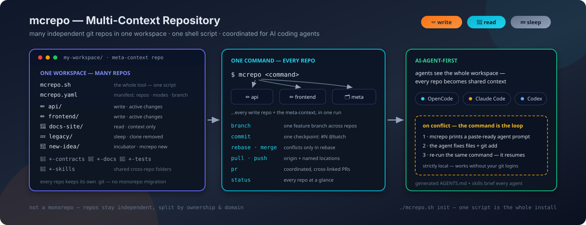

# mcrepo.sh

An AI-agent-first Meta-Context-Repository approach for MacOS and Linux.
It lets you work across many independent Git repositories in one local directory context, without migrating them into a monorepo. All managed by just one shell script: `mcrepo.sh` with practical workspace governance for multi-repo agent workflows.



## Install & Setup

- Create an empty repository
- Open it in VSCode (optional)
- Open Terminal

Excute one-liner in empty repository:

```bash
curl -fsSL https://raw.githubusercontent.com/GeektankLabs/mcrepo/main/mcrepo.sh -o ./mcrepo.sh && chmod +x ./mcrepo.sh && ./mcrepo.sh init
```

`init` automatically downloads and installs the mcrepo VS Code extension when the `code` CLI is available. To install or reinstall the extension manually at any time:

```bash
mcrepo install-extension
```

After `init`, close terminal and open a new one:

```bash
mcrepo help
```

Add repositories to your meta context:

```bash
mcrepo add <git-url>
```

If you added all needed repositories to your Meta-Context-Repository then run the suggested prompt with your local AI agent tool of choice (OpenCode, Codex CLI, Claude Code, etc) - they have now all those repositories as context and can make coordinated feature changes, documentation and integrated dev & tests setups for you.

## Modes and Visibility

Every added repository starts in `read` mode.

- `👀 read`: context available, no edits intended
- `✏️ write`: active repository where changes should be done
- `💤 sleep`: currently not relevant; reduce active scope

Switch modes with:

```bash
mcrepo write <repo-name>
mcrepo read <repo-name>
mcrepo sleep <repo-name>
mcrepo status
```

Repository folder names are always clean (no mode or emoji prefix in directory names). Mode visibility is tracked in `mcrepo.yaml` and can be decorated in the editor.

When a repo is set to `sleep`, mcrepo clears the local checkout and leaves two placeholders in that folder: `.gitignore` and `.mcrepo-sleep`. Switching back to `read` or `write` checks out the repository again.

## Branch Coordination

Before implementing a cross-repo feature, set one coordinated branch name across write repositories:

```bash
mcrepo branch <feature-branch-name>
```

Behavior details:

- When `<name>` already exists locally or on origin, mcrepo treats this as a **branch jump** — no parent is recorded. When `<name>` is new, it's a **fork** — the current branch is recorded as parent.
- If forking, mcrepo shows a confirmation prompt listing which repos will fork vs jump.
- If any target repo has uncommitted changes, mcrepo offers interactive options:
  - **Abort** — stop and handle manually
  - **Commit** — auto-commit to current branch before switching
  - **Carry** — carry changes into the target branch (stash + pop, with dry-run safety check)
  - **Discard** — discard all uncommitted changes
- If `<name>` exists on `origin` but not locally, mcrepo creates a local tracking branch from `origin/<name>`.
- After updating target repos, mcrepo switches the meta-context repo to the same branch as the final step.
- Each repo's previous branch is automatically recorded as its parent branch in `mcrepo.yaml`, enabling `mcrepo merge` later (only on fork, not on jump).

This keeps feature work aligned and makes later per-repo commits and pull requests easier to coordinate.

To turn off coordinated branching (last-resort fallback):

```bash
mcrepo branch --off
```

After `--off`, repos remain on their current branches without coordination. For a cleaner workflow, prefer `mcrepo merge` (integrate changes) or `mcrepo branch --delete` (discard branch).

### Discarding a Branch

To discard the current global branch and switch all repos back to their parent branches:

```bash
mcrepo branch --delete
```

This is the counterpart to `mcrepo merge`. While `merge` saves work into the parent, `--delete` discards the feature branch entirely:
- Aborts if any repo has uncommitted changes
- Switches each repo back to its immediate parent branch
- Deletes the feature branch locally
- Pops the parent stack one level (nested branches supported)

### Merging Back

After feature work is complete, merge the coordinated branch back into each repo's parent branch:

```bash
mcrepo merge
```

If the dry-run detects conflicts, sync with the parent branch first:

```bash
mcrepo merge --rebase
```

Behavior details:

- `mcrepo merge` requires a global branch to be set.
- Parent branches are recorded automatically by `mcrepo branch` — each repo can have a different parent.
- The meta-context repo (`.`) participates in both branching and merging with its own parent tracking (`meta-parent:` in `mcrepo.yaml`).
- `merge` performs a dry-run across ALL repos first. If any would conflict, no merges happen.
- `merge --rebase` merges the parent INTO the current branch, auto-stashing uncommitted work (including untracked files).
- Merges are local only (no push). Review and push per-repo when ready.
- Nested branches are supported: `main → feature → sub-feature`. Each `merge` pops one level.
- When no parent is recorded, mcrepo falls back to detecting the default branch (via `origin/HEAD`, remote query, or heuristic).

### Resuming or Aborting Mid-Operation Repos

If `mcrepo merge`, `mcrepo merge --rebase`, or any per-repo `git` operation
left some repos mid-merge / mid-rebase / mid-cherry-pick / mid-revert, you can
drive the recovery across all affected repos at once:

```bash
mcrepo continue   # runs git <op> --continue in every mid-op repo
mcrepo abort      # runs git <op> --abort in every mid-op repo
```

Resolve the conflicts inside each repo first (the per-repo paths are visible
via `mcrepo status` under `inprogress=…`), then run `mcrepo continue`. Sleep
mode repos are skipped. The meta-context repo participates as well.

## Pushing

```bash
mcrepo push                # fetch, refuse if behind, then push ahead repos
mcrepo push -m "message"   # also commit dirty write-mode repos before pushing
mcrepo push --no-fetch     # skip the safety fetch (faster, less safe)
```

Behavior details:

- Before pushing, mcrepo fetches `origin` for every push target (write-mode
  sub-repos plus meta-context). It then computes both **ahead** and **behind**
  per repo.
- If any target is behind its upstream, `push` aborts before any commit or
  push happens, and suggests `mcrepo pull` / `mcrepo pull --rebase` to sync
  first. This avoids partial-success runs where the first repos succeed and
  the rest get rejected mid-run.
- Failures from `git push` (auth, branch protection, hooks, non-fast-forward)
  are now printed verbatim above the summary so the cause is visible.
- Without `-m` and in non-interactive context, dirty repos are skipped (not
  silently committed). With `-m "msg"` (or interactive prompt) dirty repos
  are auto-committed via `git add -A`.
- The meta-context repo is pushed last so that sub-repo references in the
  meta-context can capture the freshly pushed sub-repo states.

## Status

```bash
mcrepo status
```

Per repo, mcrepo prints:

- `mode` (read/write/sleep), `local` (checked out yes/no), `branch`
- `state` — `clean` / `dirty`
- `upstream=<…>` — `in-sync`, `ahead=N behind=M`, or `no-upstream`
  (computed from local refs only — run `mcrepo pull` or `mcrepo push` to
  refresh first if you need the latest remote state)
- `inprogress=<…>` — `MERGING` / `REBASING` / `CHERRY-PICKING` / `REVERTING`
  / `BISECTING` when the repo is mid-operation
- `OFF-GLOBAL` — when the global branch is set but this repo sits on a
  different branch
- `parent=<stack>` — recorded parent branch stack (see Branch Coordination)

## VS Code Workflow

- Keep the meta-context root open in one VS Code window to see all repositories and shared coordination folders.
- `🗂` is the simplified mcrepo context logo used for MC-Repo actions in UI labels.
- During `./mcrepo.sh init`, mcrepo ensures `.vscode/settings.json` exists with SCM multi-repository defaults (`alwaysShowRepositories`, `selectionMode=multi`, `autoRepositoryDetection=subFolders`, `repositoryScanMaxDepth=2`). Existing settings files are kept unchanged.
- mcrepo maintains `git.ignoredRepositories` in `.vscode/settings.json` for repos currently in `sleep` mode to reduce stale SCM detection; existing user entries are preserved.
- After `init`, mcrepo attempts to trigger a VS Code window reload via the `code` CLI; if that is not possible, it prints a hint to reload/restart VS Code manually.
- In the VS Code Explorer context menu (sub-repo folder right-click), the extension shows MC-Repo mode actions as `🗂 ✏️ Set Write`, `🗂 👀 Set Read`, and `🗂 💤 Set Sleep`.
- The VS Code extension watches `mcrepo.yaml` / `.vscode/settings.json` and prompts a window reload when repo topology changes (new repo or sleep<->active transitions) may require SCM refresh.
- If a write repository has changes, open it in a dedicated VS Code window:

```bash
mcrepo open <repo-name>
```

- Commit and push inside that repository, preserving per-repo autonomy.

## Directory Structure After Init

`init` generates coordination directories in the meta-context root:

- `🧩 contracts/`: cross-repo interfaces and contracts
- `🧾 docs/`: architecture, integration notes, and generated overviews
- `🧪 tests/`: integration test setup and shared test assets
- `🧠 skills/`: company and project specific skills (`skill.md`) with optional colocated helper scripts
- `mcrepo.yaml`: source of truth for repos, modes, descriptions, and branch
- `AGENTS.md`: generated workspace instructions that enforce mode gates and proactively point agents to RepoMapper MCP for codebase overview and Playwright for browser validation when available

Design ordering principle:

- Repositories use clean top-level names.
- Shared folders (`🧩 contracts`, `🧾 docs`, `🧪 tests`, `🧠 skills`) are created directly at the top level.
- The old visual separator directory is no longer created.

## Skills and Workspace Governance

Use `mcrepo` skill commands to manage workspace-local skill packs:

```bash
mcrepo skill list
mcrepo skill new <skill-id>
mcrepo skill install <github-url>
mcrepo skill install <clawhub-url>
mcrepo skill <repo-name> install <github-url|clawhub-url>
mcrepo skill enable <skill-id>
mcrepo skill disable <skill-id>
mcrepo skill validate
```

Skill source support:

- GitHub URLs are supported for direct skill import.
- ClawHub URLs are supported and scanned through Gen Agent Trust Hub before install.
- Recommended public skill directory: `https://clawhub.ai/skills`

ClawHub scan policy defaults:

- `CRITICAL` scan severity blocks install.
- `HIGH` scan severity warns and continues.
- Use `--skip-scan` to bypass scanner checks.
- Use `--require-scan` to fail when scan cannot be performed.

Activation behavior:

- If `🧠 skills/skills.yaml` exists, enable/disable state is taken from that file.
- If `🧠 skills/skills.yaml` is missing, every `🧠 skills/<id>/skill.md` is treated as active.
- MC workspace skills are mirrored into `.opencode/skills/` so OpenCode can auto-discover them.
- For sub-repositories, use standard `.opencode/skills/` (no emoji folder) for local skill installs.

Skill layout (colocated docs + helpers):

```text
🧠 skills/
  skills.yaml
  _templates/
    skill-template.md
  change-implementation/
    skill.md
    run.sh   # optional helper
```

Authoring notes:

- Keep each skill self-contained in `🧠 skills/<id>/`.
- Put process and guardrails in `skill.md`.
- Put optional executable helpers (`run.sh`, `check.sh`) next to `skill.md`.
- Use lowercase kebab-case skill IDs (for example: `release-prep`, `test-gate`).

Default skill pack created during `init`:

- `change-implementation`
- `test-gate` (includes Playwright guidance for web-facing validation when available)
- `release-prep`
- `no-secrets`
- `subproject-skill-loader` (loads sub-repo local skills only for write/change scope)

These are starter skills meant to be edited or replaced with your company-specific workflows.

## AI-Agent-First Starter Tasks

After adding repositories, useful first tasks are:

1. Ask your agent to scan all `read` repos and write an interface map into `🧾 docs/`.
2. Ask your agent to scaffold an integration test setup (for example Docker Compose) in `🧪 tests/`.
3. Ask your agent which repos should be switched to `write` for your next feature.

## Why This Instead of a Monorepo?

- No full migration of codebases into one repository.
- No forced unified build and release system.
- Still supports coordinated cross-repo feature work.
- Better fit when repos are already split by ownership and domain.

This means lightweight context orchestration, not a central release manager.

## Private Meta-Repo Pattern

You can keep component repositories public/open-source while keeping the `mcrepo` workspace repository private for internal coordination.

## Additional Options

- Skip shell config installation during init (recommended for CI or disposable sandboxes):

```bash
./mcrepo.sh init --no-shell-install
```

- `init` always uses clean repo folder names:

```bash
./mcrepo.sh init
```


## Versioning and Self-Update

- `mcrepo.sh` includes a built-in script version and prints it on each run.
- By default, `mcrepo` checks the canonical upstream script (`GeektankLabs/mcrepo`, `main`, `mcrepo.sh`) and notifies you when a newer version exists.
- Run `mcrepo update` to self-update the script in place.
- Override update source URL (for forks/mirrors) with `MCREPO_UPDATE_URL`.
- Disable automatic update checks with `MCREPO_DISABLE_UPDATE_CHECK=1`.

## Patch Submission Without Repository Checkout

- Run `mcrepo export-patch [--strategy intent|legacy] [topic]` (or `mcrepo create-patch ...`).
- Default strategy is `intent`: mcrepo tries to carry only your feature intent onto current upstream and avoid rollback-style hunks.
- Use `--strategy legacy` to force raw `upstream-main vs local-file` diff behavior.
- If you omit `[topic]` in an interactive terminal, mcrepo asks for a short 2-5 word title and supports Enter for a default `Feature update <timestamp>` title.
- When `[topic]` is omitted and mcrepo prompts you, it pauses after the instructions and waits for Enter before printing issue title/body content.
- The command prints everything to stdout:
  - submission steps and issue URL
  - issue title
  - full issue body with embedded `mcrepo.sh` patch against canonical upstream
- Open a new issue, use title prefix `[PATCH SUBMISSION]`, paste the printed issue body, and submit.

## Platforms

- Current focus: macOS
- Target support: Linux

## Origins

The approach comes from practical maintainer experience in multi-repository open-source work, including the RaspiBlitz ecosystem.
